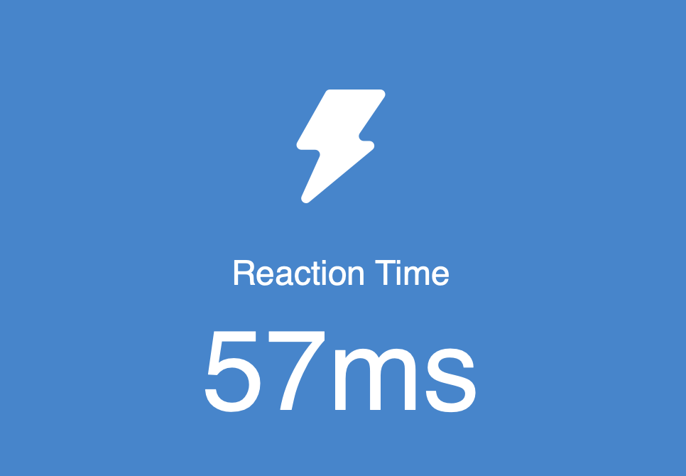

# Reaction-Time Auto Clicker

**A Lightweight Human Benchmark Reaction Test Bot**
*Built with Python, PyAutoGUI, and MSS*



---

## Overview

**Reaction-Time Auto Clicker** is a simple automation tool that plays the
[Human Benchmark Reaction Time Test](https://humanbenchmark.com/tests/reactiontime) by instantly clicking when the screen turns green.

The script continuously samples the pixel color under your mouse cursor using **MSS** and performs a fast click through **PyAutoGUI** when the reaction trigger is detected. The program automatically exits after **5 successful rounds**, making it a quick and hands-free way to test or demonstrate reaction timing behavior.

---

## Tech Stack

* **Programming Language:** Python
* **Libraries:** PyAutoGUI, MSS, Sys, Time
* **Platform:** macOS / Windows / Linux

---

## How It Works

1. **Monitor Cursor Position** – The script tracks the pixel directly under the mouse pointer.
2. **Detect Screen State** – When the pixel matches the reaction-test green `(119, 216, 119)`, the bot identifies the “click now” state.
3. **Auto-Click Instantly** – PyAutoGUI triggers a fast mouse click at the current position.
4. **Auto-Exit After 5 Rounds** – The script counts successful clicks and terminates after completing five reaction cycles.

---

## Installation

```bash
pip install pyautogui mss
```

> On macOS, Python may require **Accessibility / Input Monitoring** permissions in System Settings.

---

## Run the Bot

```bash
python Reaction.py
```

Then:

1. Open the Reaction Time Test
2. Hover your mouse over the clickable area
3. Start the game
4. Let the bot click for you

---

## Example Output

```
Bot Active!
CLICKED
CLICKED
CLICKED
CLICKED
CLICKED
Game Finished!, Exiting Program...
```

---

## Disclaimer

This project is for **educational and experimental use only**.
Do not use it to misrepresent reaction-time results or in competitive contexts.

---
